  <picture>
    <source media="(prefers-color-scheme: dark)" srcset="assets/hero-dark.svg">
    
  </picture>

  
  

  <picture>
    <source media="(prefers-color-scheme: dark)" srcset="assets/stack-dark.svg">
    
  </picture>

<h3 align="center"><code>&gt;&gt;&gt; help(me.projects)</code></h3>

<!-- PROJECTS:START -->

<a href="https://github.com/suryaanshrai/omnipost"><picture><source media="(prefers-color-scheme: dark)" srcset="assets/projects/omnipost-dark.svg"></picture></a>
<a href="https://github.com/suryaanshrai/minesweeper"><picture><source media="(prefers-color-scheme: dark)" srcset="assets/projects/minesweeper-dark.svg"></picture></a>
<a href="https://github.com/suryaanshrai/cube_solver"><picture><source media="(prefers-color-scheme: dark)" srcset="assets/projects/cube_solver-dark.svg"></picture></a>
<a href="https://github.com/suryaanshrai/jovialText"><picture><source media="(prefers-color-scheme: dark)" srcset="assets/projects/jovialText-dark.svg"></picture></a>

<!-- PROJECTS:END -->

<h3 align="center"><code>&gt;&gt;&gt; me.stats()</code></h3>

  <picture>
    <source media="(prefers-color-scheme: dark)" srcset="assets/stats-dark.svg">
    
  </picture>
  <picture>
    <source media="(prefers-color-scheme: dark)" srcset="assets/contributions-dark.svg">
    
  </picture>

<h3 align="center"><code>&gt;&gt;&gt; me.recent()</code></h3>

<!-- NOW:START -->
- 🔨 Pushed to [suryaanshrai/suryaanshrai](https://github.com/suryaanshrai/suryaanshrai) · 10 days ago
- 🔀 Merged PR [#4](https://github.com/suryaanshrai/suryaanshrai/pull/4) in [suryaanshrai/suryaanshrai](https://github.com/suryaanshrai/suryaanshrai) · 10 days ago
- 🔀 Opened PR [#4](https://github.com/suryaanshrai/suryaanshrai/pull/4) in [suryaanshrai/suryaanshrai](https://github.com/suryaanshrai/suryaanshrai) · 10 days ago
- 🔀 Merged PR [#3](https://github.com/suryaanshrai/suryaanshrai/pull/3) in [suryaanshrai/suryaanshrai](https://github.com/suryaanshrai/suryaanshrai) · 10 days ago
- 🔀 Opened PR [#3](https://github.com/suryaanshrai/suryaanshrai/pull/3) in [suryaanshrai/suryaanshrai](https://github.com/suryaanshrai/suryaanshrai) · 10 days ago
- 🔀 Merged PR [#2](https://github.com/suryaanshrai/suryaanshrai/pull/2) in [suryaanshrai/suryaanshrai](https://github.com/suryaanshrai/suryaanshrai) · 10 days ago
<!-- NOW:END -->

 

  <code>&gt;&gt;&gt; random.choice(me.fun_facts)</code> 
<!-- FACT:START -->
<em>The word &quot;robot&quot; comes from the Czech &quot;robota&quot;, meaning forced labour.</em>
<!-- FACT:END -->

